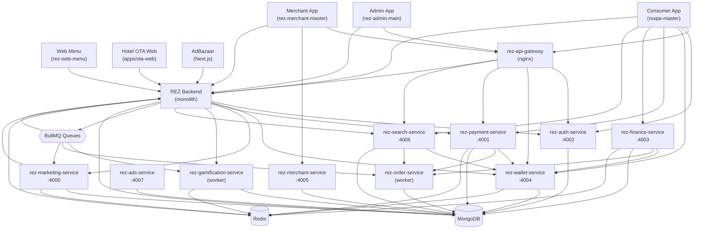

# MASTER SERVICE DEPENDENCY MAP — REZ Platform

> Last updated: 2026-04-10
> Maps which services call which other services, app-to-service relationships, and BullMQ job flows.

---

## 1. High-Level Dependency Graph (Mermaid)



---

## 2. App → Service Call Matrix

| App / Client | rez-auth | rez-wallet | rez-payment | rez-finance | rez-search | rez-merchant | rez-marketing | rez-ads | Monolith |
|--------------|----------|------------|-------------|-------------|------------|--------------|---------------|---------|---------|
| Consumer App | Direct | Direct | Direct | Direct | Direct | — | — | — | Direct |
| Merchant App | — | — | — | — | — | Direct | — | — | Direct |
| Admin App | — | — | — | — | — | — | — | — | Direct |
| Web Menu | — | — | — | — | — | — | — | — | Direct (`/api/web-ordering/`) |
| Hotel OTA | Direct (guest creation) | — | — | — | — | — | — | — | Direct (webhooks) |
| AdBazaar | — | — | — | — | — | — | — | — | Direct (webhooks) |
| API Gateway | Routes to → | Routes to → | Routes to → | — | Routes to → | — | — | — | Routes to → |

---

## 3. Service → Service Calls (Internal Token Auth)

All internal calls use `x-internal-token` header matching `INTERNAL_SERVICE_TOKENS_JSON` (scoped) or `INTERNAL_SERVICE_TOKEN` (legacy).

| Caller | Callee | Endpoint Called | Purpose |
|--------|--------|----------------|---------|
| rez-payment-service | rez-wallet-service | `POST /internal/credit` | Credit coins after payment success |
| rez-payment-service | rez-wallet-service | `POST /internal/debit` | Debit coins for wallet payment |
| rez-payment-service | rez-order-service | Internal order lookup | Verify order before payment |
| rez-finance-service | rez-wallet-service | `POST /internal/credit` | Award coins for bill pay / recharge (Phase 2) |
| rez-finance-service | rez-order-service | `/finance/internal/user-summary/:userId` | User order context for credit scoring |
| rez-search-service | rez-wallet-service | `GET /internal/balance/:userId` | Wallet data for personalized homepage |
| rez-search-service | rez-order-service | Internal order list | Order context for recommendations |
| REZ Monolith | rez-auth-service | `POST /internal/auth/verify-token` | Token verification (when not using local JWT verify) |
| REZ Monolith | rez-wallet-service | `POST /internal/credit` | Issue coins from reward engine |
| REZ Monolith | rez-wallet-service | `POST /internal/debit` | Deduct coins during payment flow |
| REZ Monolith | rez-marketing-service | Internal broadcast triggers | Campaign event delivery |
| rez-marketing-service | REZ Monolith | Internal user/store lookups | Audience segmentation data |

---

## 4. BullMQ Job Producers and Consumers

### Queue: `gamification:achievement`

| Producer | Consumer | Job Type | Trigger |
|----------|---------|----------|---------|
| REZ Monolith (`gamificationEventBus.ts`) | `rez-gamification-service/achievementWorker.ts` | Achievement unlock check | User action events |
| REZ Monolith | `rez-gamification-service/storeVisitStreakWorker.ts` | Streak update | `visit_completed`, `visit_checked_in` events |

### Queue: `gamification:streak`

| Producer | Consumer | Job Type | Trigger |
|----------|---------|----------|---------|
| REZ Monolith | `rez-gamification-service/storeVisitStreakWorker.ts` | Store visit streak | QR check-in, visit completion |

### Queue: `notifications`

| Producer | Consumer | Job Type | Trigger |
|----------|---------|----------|---------|
| REZ Monolith | `rez-notification-events` worker | Push / SMS / WhatsApp | Order updates, gamification events, marketing |
| rez-marketing-service (`campaignWorker`) | rez-notification-events | Campaign broadcasts | Scheduled campaigns |

### Queue: `marketing:campaigns`

| Producer | Consumer | Job Type | Trigger |
|----------|---------|----------|---------|
| REZ Monolith | `rez-marketing-service/campaignWorker.ts` | Campaign send | Campaign schedule or trigger |
| Admin API | `rez-marketing-service/campaignWorker.ts` | Broadcast | Admin-triggered broadcast |

### Queue: `marketing:interest-sync`

| Producer | Consumer | Job Type | Trigger |
|----------|---------|----------|---------|
| Scheduler | `rez-marketing-service/interestSyncWorker.ts` | Interest sync | Cron (birthday, behavioral) |

### Queue: `media:upload`

| Producer | Consumer | Job Type | Trigger |
|----------|---------|----------|---------|
| REZ Monolith | `rez-media-events` worker | Media processing | Photo/video upload |

### Queue: `orders`

| Producer | Consumer | Job Type | Trigger |
|----------|---------|----------|---------|
| REZ Monolith | `rez-order-service/worker.ts` | Order lifecycle | Order state changes |

### Queue: `wallet:operations`

| Producer | Consumer | Job Type | Trigger |
|----------|---------|----------|---------|
| REZ Monolith (`walletOperationQueue.ts`) | REZ Monolith worker | Wallet credit/debit | High-concurrency coin operations |

---

## 5. Socket.IO Connections

| App | Connects To | Namespace | Auth | Room Pattern | Notes |
|-----|------------|-----------|------|-------------|-------|
| Consumer App | REZ Monolith | `/` (root) | JWT Bearer | `user-{userId}` | HTTP polling used instead (no socket client in consumer) |
| Merchant App | REZ Monolith | `/` (root) | JWT Bearer | `merchant-{merchantId}` | Polling-first transport (iOS compat) |
| KDS Display | REZ Monolith | `/kds` | JWT Bearer | `kds:{storeId}` | KDS receives `new_order` events |
| Web Menu | REZ Monolith | None | N/A | N/A | No Socket.IO — uses HTTP polling for order status |

---

## 6. External Integrations

| Service | Used By | Purpose | Auth Method |
|---------|---------|---------|------------|
| Razorpay | rez-payment-service, REZ Monolith | Payment processing | API key + webhook HMAC |
| Firebase FCM | REZ Monolith, Rendez backend | Push notifications | Service account JSON |
| Twilio / SMS | rez-auth-service | OTP delivery | API key |
| WhatsApp API | rez-auth-service | OTP via WhatsApp | API key |
| FinBox | rez-finance-service | Loan/credit offers | API key + webhook HMAC |
| Cloudinary | REZ Monolith | Media upload/CDN | API key + secret |
| Sentry | All services | Error tracking | DSN |
| MongoDB Atlas | All services | Primary database | Connection URI |
| Redis (Upstash/Redis Cloud) | Most services | Cache, queues, rate limits | Connection URL |

---

## 7. Hotel OTA Integration Points

```
Hotel OTA Web (Next.js) ──→ Hotel OTA API (PostgreSQL)
                                    │
                                    ├──→ REZ Backend: POST /api/webhooks/hotel-attribution
                                    │    (Booking events → coin credits)
                                    │
                                    └──→ Hotel PMS (MongoDB)
                                              │
                                              └──→ REZ Backend: PMS webhook events

REZ Backend ──→ rez-auth-service: POST /internal/auth/create-user
               (Guest user creation for Hotel OTA users)
```

---

## 8. AdBazaar Integration Points

```
AdBazaar (Supabase) ──→ REZ Backend: POST /api/webhooks/adbazaar
                         (QR scan events → attribution → coin credits)

REZ Backend ──→ AdBazaar: POST ADBAZAAR_WEBHOOK_URL
                (Visit/purchase attribution events)
```
